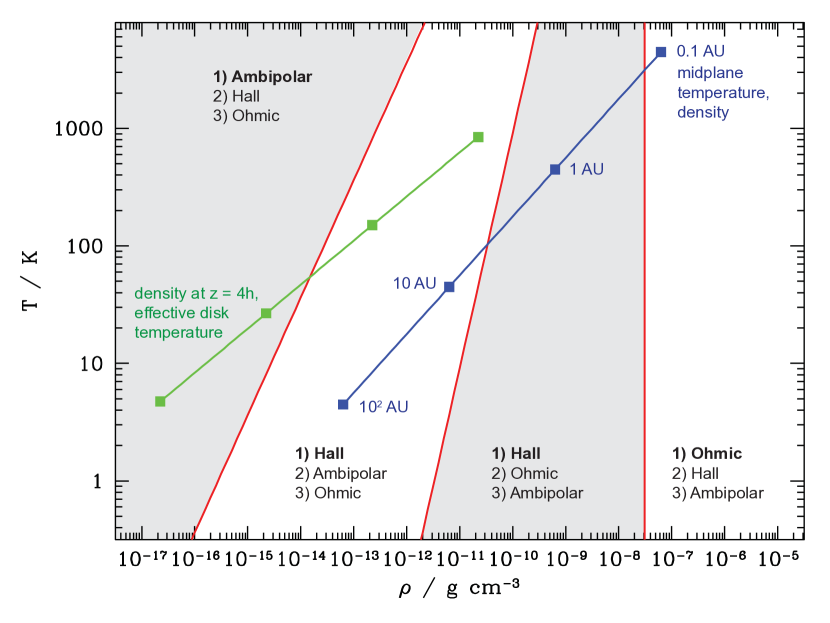

# Class Recap: Week No. 15 - March 13, 2024
## Topic: Non-ideal Magnetohydrodynamics (MHD)

### Summary

This lecture was an extension of the discussion of magnetic fields in the formation of protostars and their surrounding dust disks. When we discussed ideal MHD in the lecture prior, we came to the realization that idealized cases were too simplified on smaller scales and even lead to issues such as the magnetic braking catastrophe. The lecture on nonideal MHD briefly introduced and covered ohmic resistivity, ambipolar diffusion, and the Hall effect, and reiterated the importance of scaling when considering which magnetic field effects to implement in a simulation.

### Outline 
# Charges to consider
+ Electrons (current carriers)
+ Ions
+ Neutrals

# Nonideal MHD effects (not inclusive of all, just what was discussed in class):

(Schematic of how MHD driven accretion in protoplanetary disks might proceed, adapted from [Simon et al. 2015](https://ui.adsabs.harvard.edu/abs/2015MNRAS.454.1117S/abstract))
+ Ohmic resistivity: dissipation of electrical energy into thermal energy for a plasma with a resistivity. $j=\sigma{E}'$, for $\sigma\propto\frac{1}{\eta}$. Here, $\sigma$ is the conductivity and $\eta$ is the resistivity.
+ Ambipolar diffusion: ion-neutral drag seen in partially ionized plasma, where the magnetic field can decouple from the plasma.
+ Hall effect: electron-ion drag, due to the movement of charged particles in a magnetic field. Non-dissipative and applies to Coulomb scales more than dynamical scales.

(Plot of the relative importance of non-ideal MHD terms in the rho-T plane, from [Armitage 2011](https://ui.adsabs.harvard.edu/abs/2011ARA%26A..49..195A/abstract))

# Case study of the ambipolar diffusion effect:
Taking a drag force $f_{d}=\gamma\rho_{n}\rho_{i}(v_{i}-v_{n})$, where $\gamma = 3.5\times10^{13} cm^{3}g{-1}s{-1}$ is the drag coefficient (Draine, 1983), we can plug it into our MHD equation:  
$\vec\nabla\times\vec E=\frac{-\delta \vec B}{\delta t} = \vec\nabla\times(\vec B \times \vec u)$  
$\vec\nabla\times(\frac{\vec B}{4\pi\gamma\rho_i\rho_n}\times\vec B\times(\vec \nabla \times \vec B))$, where the denominator term is the drag force times a CGS conversion related term.  
Recalling current density $\vec j = e\Sigma n_s Z_s \vec u_s$, where we add over all the species of charges for the total current density, we can balance the Lorentz force with the drag force for arbitrary species and end up with:  
$\vec j = \sigma_o{E_\parallel }'+\sigma_HB\times{E_\perp}'+\sigma_P{E_\perp}'$, where each $\sigma$ is related to each MHD effect we are exploring (ohmic, Hall, ambipolar). In practice, however, we need not dive into these expressions and we can take a look at what most people show in their work:  
$\frac{\delta B}{\delta t}=\vec \nabla \times (\vec u\times\vec B)-\frac{4\pi}{c}\vec \nabla \times (\eta_o\vec j +\eta_H(\vec j \times \vec B)+ \eta_A j_\perp)$, with the magnetic energy dissipative rate is shown in $E = \frac{4\pi}{c}(\eta_o j^2_\perp + \eta_A j^2_\perp)$

# Some discussion:
It is quite hard to measure magnetic fields in disks with small enough dust particles - when scattering is relevant, it can be tough to tell whether dust polarization occurs because of thermal ionization on the magnetic field.

# Important scalings to consider:
Three types of MHD solutions are:
+ Alfven wave: $\upsilon_A = \sqrt{\frac{B^2}{4\pi\rho}}$, the dominant speed, used for comparing magnetic field effects to others. Can be used to further calculate the Elsasser number, which compares the dissipation of a magnetic field with a timescale.
+ Slow magnetosonic: $\upsilon_A - c_s$
+ Fast magnetosonic: $\upsilon_A + c_s$

### Questions 
Questions we considered in class included why we would use the nonideal MHD effects at all, for which we learned there is a scaling dependency. A question I had was whether the Elsasser number compares to a dynamical timescale. I was also curious as to what (if any) other effects can be included in the nonideal MHD scenarios.

### Related Resources

[https://www.maths.dur.ac.uk/users/anthony.yeates/yeates-mhd2021.pdf] A lecture by professor Anthony Yeates from Durham University on MHD. [Manuel Ramirez]

[https://www.mpe.mpg.de/7283848/mhd#:~:text=The%20relative%20strengths%20of%20non,diffusivity%20and%20promotes%20disk%20formation.] A paper that highights whether a disk forms based on its MHD effects. [Manuel Ramirez]
